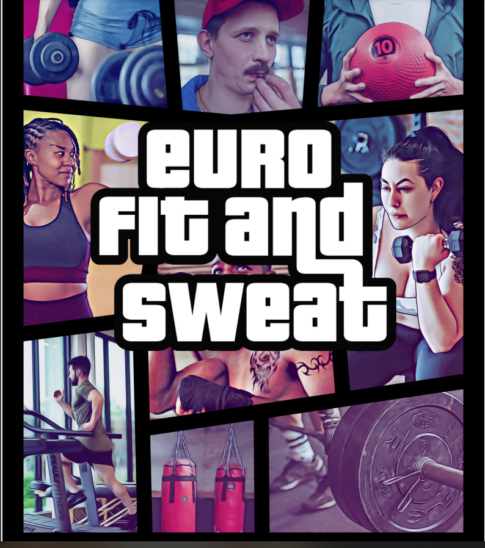
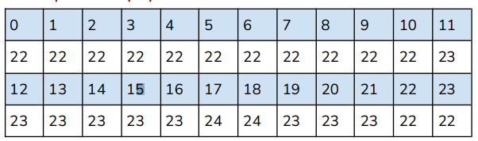
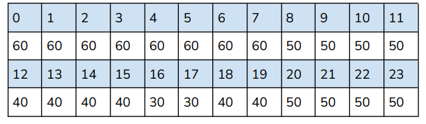
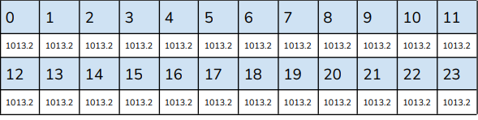

# Brief 5

Antony Schutz,
CDA PDH Java 2023

## Contexte du projet

En tant que concepteur de base de données, vous devez réaliser les différents élément des méthodes vues en formation: 
MCD/MLD/MPD, expliquer vos choix pour les types de données et présenter le diagramme de votre base de données final.

## Ce qui est autorisé et attendu 

Les discussions en groupe sont autorisées mais les rendus (code) et les réflexions (document) doivent être individuelles. 
Une grande créativité et souplesse sur le sujet sont attendues.
Il n’est pas possible de faire le brief à 100% dans le temps imparti aussi faites de votre mieux pour faire le minimum fonctionnel. 
Il vaut mieux en faire peu mais le faire à 100%.
Toute ressemblance avec des personnes ou des situations ayant existé ou non ne saurait être que fortuite et trouver toutes les références ne
rapportera pas de point supplémentaire.

Conseil:
Prenez beaucoup de temps pour bien lire le sujet dans sa totalité puis mettez vous d’accord sur la structure du point le plus important que
vous choisirez. Vous pouvez focaliser l’étude sur les clients ou sur les clubs, prenez le temps de bien discuter entre vous pour choisir l’un des
deux et décidez d’une structure commune. Puis, individuellement, choisissez l’extension que vous souhaitez approfondir, le sujet est
extrêmement vaste et imparfait, alors soyez créatif et méticuleux.
Partez d’une structure commune, l’idéale étant que tous vos travaux réunis puissent être assemblés en un seul grand projet.

## Outils

- Codes et diagrammes:
Compatible avec mysql workbench.

- Rapport:
Lien Google doc.

## Ce qui doit être rendu

- Document:
Un document contenant les MCD/MLD et MPD de la base de données (BDD) créée ainsi que le détail des réflexions sur le choix des tables,
type de données, relation entre les tables, les vues et optionnellement les triggers. 
Un effort vous sera demandé pour présenter le diagramme de la base de données, les tables et les vues, de la manière la plus lisible et esthétiquement possible.

- Code:
    - Vous devez rendre un **premier fichier** comprenant le code de la création de la base de données ainsi que de ses vues, chaque apprenant devra nommer sa BDD sous le format: **euro_fit_”prenom”**.
  Vous utiliserez les informations fournies pour remplir quelques lignes de ces tables afin de montrer votre capacité à faire des requêtes avancées dans un système de base de données relationnelle.
  - Dans deuxième fichier, vous fournirez le code d’insertion des données dans la base de données.
  - Dans un troisième fichier vous fournirez les codes illustrant les
  requêtes.
  - Finalement un dernier fichier démontrera votre capacité à modifier des tables, car vous voudrez rajouter quelque chose, tout en vérifiant que les requêtes fonctionnent toujours.

## Sujet

### Historique

EURO FIT AND SWEAT est une chaîne de salle de sport répartie sur toute l’Europe, cette chaîne fonctionnait sur le principe de la franchise i.e
toutes les salles étaient indépendantes.
Depuis peu un philanthrope milliardaire, Avon Hertz ainsi que son associé anonyme connu sous le nom de Albert Innocent Clifford, ont fini
par racheter tous les clubs de la franchise et souhaite réunir toutes les informations possibles des clubs et de leurs usagers. Ils veulent que les
informations soient centralisées dans une seule base de données.

### Innovations

Cette action prend part avec le but majestueux d’optimiser la gestion
des clubs et de fournir aux sportifs des statistiques détaillées pouvant
les aider à s’améliorer.

- humanisme:
Toujours dans un esprit de noblesse et d’humanisme, les salles deviendront pratiquement complètement automatisées ce qui offrira
plus de confort aux utilisateurs et l’erreur humaine sera réduite!
- flexibilité:
Ils souhaitent notamment proposer un abonnement unique en Europe afin que n’importe quel usager ait accès à n'importe quel club du
groupe. Les clubs seront maintenant ouverts toute l’année et 7 jours sur 7 et de 5 heures du matin à 2 heures du matin pour les membres premium, ce qui laissera 3 heures aux équipes de ménage pour agir!
- modernité:
Chaque membre de EURO FIT AND SWEAT possède, en location annuelle afin d’en limiter l’usure, une carte de membre associé à son abonnement qui lui permet d’avoir accès aux clubs ainsi qu'à l'utilisation des machines, des salles de groupes et lieux d’hygiène.
- écologie:
Les machines produisent de l'énergie durant leurs utilisations et alimentent les systèmes électroniques de chaque machine mais qui en
cas de surplus sont aussi redistribuées sur le réseau, notamment les salles de vélo ou les elliptiques en mode montagne L.Santos ou Skyrim.
Des capteurs de température, pression, humidité et de qualité de l’air sont répartis dans les salles afin d’ajuster au mieux les climatiseurs et
les purificateurs d’air afin d’éviter leur sur-utilisation pour le plus grand
confort des membres.
Chaque utilisateur doit badger pour pouvoir utiliser une machine et la re-badger lorsque l’effort est fini. Cela permet dans un premier temps de réserver la machine pour un utilisateur, contrairement à l’utilisation archaïque voir primitive d'une serviette pour le montrer, mais aussi de connaître le temps passé sur la machine.
Si un utilisateur oublie d’éteindre une machine il se verra recevoir une pénalité car, dans un souci d’égalité et d’écologie, sujets qui touchent
très profondément Monsieur Hertz, les systèmes auxiliaires du club devront être utilisés pour alimenter la machine et d’autres utilisateurs
seront pénalisés et frustrés de ne pas pouvoir utiliser une machine vide.
Il en va de même pour les casiers de rangement et les lieux d'hygiène (toilettes douches).
Les pénalités peuvent se rembourser sous formes d’argent ou bien d’intérêt général comme par exemple en faisant partie de l’équipe de nettoyage entre 2h et 5h du matin.
- maintenance et dégradation:
Si une machine montre un défaut de fonctionnement ou une dégradation, il conviendra à l’utilisateur de le signaler en pressant un bouton sur la machine et de fournir des photos si possible.
sécurité et harcèlement Si les règles de sécurité ne sont pas respectées ou si des utilisateurs
commencent un affrontement physique ou verbal, même s’il est justifié pour raison d’honneur ou autre, il sera demandé aux témoins de
prévenir la sécurité, de prendre des photos et d’en assumer la responsabilité.
Les harcèlements physiques, verbaux et visuels sont aussi fortement interdits.
Une tenue correcte est exigée ainsi que le comportement des membres.
- responsabilité:
En cas du moindre problème sachez que la direction ne pourra en être tenue pour responsable. A.I Clifford, étant très sensible par nature et très attaché à son image impeccable, pourra s’octroyer le droit de porter
plainte contre d'éventuels plaignants en faisant appel aux cabinets L.Crest & T.Phillips.

## Les données, données par EURO FIT AND SWEAT

### Les types d’abonnement

Voici les différents type d’abonnement auxquels un membre peut souscrire:

- VIP:
Donne accès à tous les clubs, toutes les salles, toute l’année et les compléments alimentaires sont fournis sous contrôle d’un coach sportif
présent à toutes vos séances et un accès aux lieux d’hygiène en illimité.
Un bilan corporel vous est offert tous les mois. Le client peut avoir une place de parking sous réservation (payante).
**Prix: 200 € par mois sur 12 mois.**
- premium version international:
Donne accès à tous les clubs, toutes les salles, toute l’année. Les compléments alimentaires, les séances de coaching ont un discount de
25%. Un bilan corporel vous est offert tous les mois. Le client peut avoir une place de parking sous réservation (payante) et un accès aux
lieux d’hygiène en illimité.
**Prix: 175 € par mois sur 12 mois**
- premium:
Donne accès à un club, toutes les salles et toute l’année. Les compléments alimentaires, les séances de coaching ont un discount de
25%. Un bilan corporel vous est offert tous les mois. Le client peut avoir une place de parking sous réservation (payante) et un accès aux
lieux d’hygiène en illimité.
**Prix: 150 € par mois sur 12 mois**
- cycliste international:
Grâce à son partenariat avec P&M l’abonnement cycliste international donne accès à tous les clubs, toutes les salles pour cyclistes et lieux
d’hygiène en illimité. Les compléments alimentaires et antalgiques vous sont offerts.
**Prix: 150 € par mois sur 12 mois.**
- cycliste d’eau douce:
Grâce à son partenariat avec P&M l’abonnement cycliste international donne accès à un club, toutes les salles pour cyclistes et lieux
d’hygiène. Les coachs, compléments alimentaires sont en supplément.
**Prix: 100 € par mois sur 12 mois.**
- le muscle est partout:
Donne accès illimité à tous les clubs, toutes les machines et lieux d’hygiène en illimité. Les compléments alimentaires et antalgiques vous
sont offerts.
**Prix: 150 € par mois sur 12 mois.**
- membre international:
Donne accès à tous les clubs, toutes les salles et lieux d’hygiène. Les compléments alimentaires et antalgiques vous sont offerts.
**Prix: 135€ par mois sur 12 mois.**
- brain-l fit international:
Donne accès à tous les clubs, toutes les salles d’activités collectives.
Les coachs, compléments alimentaires sont en supplément.
**Prix: 130€ par mois sur 12 mois.**
- b less-fit:
Donne accès à un club, toutes les salles d’activités collectives.
Les coachs, compléments alimentaires sont en supplément.
**Prix: 125€ par mois sur 12 mois.**
- membre:
Donne accès à un club et lieux d’hygiène. Les salles, compléments alimentaires et activités collectives sont en supplément.
**Prix: 100 € par mois sur 12 mois.**
- coach:
Nos experts triés sur le volet et sur leurs compétences, trouvez le vôtre dans notre rubrique coach. Les membres rembourse votre abonnement
et 5% de leurs dépenses en compléments alimentaires et activités annexes vous sont reversés.
**Prix: 50€ par mois sur 12 mois.**
- agent de nettoyage et de sécurité:
Le nettoyage et la sécurité sont sous traités en passant par des agences spécialisées. Ces agents ont le droit de posséder un badge gratuitement, cependant ils ne peuvent utiliser les équipements et différentes salles (hygiènes comprisent) et ne peuvent que les nettoyer ou protéger.

### Les analyses corporelles:

Chaque coach loue son équipement CORPO-ANALYZER pour 5 euros par mois. Ces données sont stockées dans nos bases de données (historisation) tant qu’un membre paye son abonnement.
CORPO-ANALYZER permet d’analyser en quelques secondes votre:

- IMC:
L’indice de masse corporel, il se calcule simplement en divisant le poids (en kg) par le carré de la taille (m).
La valeur calculée, la valeur de référence et écart à la dernière mesure.
- métabolisme de base:
Il s'agit d'une estimation de la quantité d'énergie (en calories) que votre
corps a brûlé lorsqu'il est au repos, de manière quotidienne.
La valeur calculée, la valeur de référence et écart à la dernière mesure.
- besoins énergétiques:
Les besoins énergétiques correspondent à la quantité de calories nécessaires au bon fonctionnement de votre organisme.
La valeur calculée, la valeur de référence et écart à la dernière mesure.
- masse sèche hors graisse:
La masse sèche hors graisse donne une estimation du niveau de masse protéique et minérale du corps. Il est ainsi possible d'en déduire la
masse musculaire avec grande précision et d'en suivre l'évolution.
La valeur calculée, la valeur de référence et écart à la dernière mesure.
- contenu minéral osseux:
Correspond à la quantité de minéraux dans un volume donné de matière osseuse. La valeur calculée, la valeur de référence et écart à la
dernière mesure.
- masse grasse à hydratation constante:
La masse grasse à hydratation idéale permet d'obtenir une mesure constante de la masse grasse quel que soit le niveau d'hydratation.
La valeur calculée, la valeur de référence et écart à la dernière mesure.
- eau totale corporelle:
La quantité d’eau totale contenue dans votre organisme.
La valeur calculée, la valeur de référence et écart à la dernière mesure.
- masse grasse, masse musculaire et masse hydrique:
valeur mesurée

### Les conditions d’une salle d’un club:

Une salle d’un club, salle d’hygiène et accueil compris, possède un ou plusieurs capteurs permettant de mesurer plusieurs paramètres, un par
type de capteur installé. Une salle d’un club possède donc un nombre de capteurs par type de capteur. Chaque capteur possède une id unique
pour le club dans lequel il est installé ainsi qu’une valeur pour:

- La température (T):
Température au niveau du capteur
- L’hygrométrie (H):
Le niveau d’humidité au niveau du capteur
- La pression (P):
La pression au niveau du capteur qui devrait être la même dans tout le club.
- La qualité de l’air (Q):
Le niveau d’oxygène/CO2 au niveau du capteur.

De plus, chaque salle possède un certain nombre de purificateur d’air et de climatiseur réversible.
Les dépenses énergétiques sont sauvegardées pour optimisation, ainsi les dépenses électriques de chaque salle sont mesurées afin de
mesurer l’impact CO2 de chaque activité, cela permet de mettre à jour le prix des abonnements et de sauvegarder la planète.
L’écologie et le confort sont au centre de nos préoccupations, vous laissant le temps de vous focaliser sur votre santé.

### Les clubs

Un club s’identifie par son nom qui lui est unique, ou par le biais d’un identifiant qui le relie à son nom, et dépend du quartier de la ville où il est installé. En effet la politique écologique de A.Hertz veut qu’on ne multiplie pas les clubs pour rien, les garages à vélo sont disponibles autour de chaque club. En plus de son nom, certaines informations sont
importantes à connaître telles que l’adresse et les moyens de contact, le contrat d’assurance et donc les informations sur l’assureur, la superficie, le nombre de salle, les activités proposées, le nombre de machines, le
nombre de membres etc…

### Les salles

Chaque salle d’un club possède aussi un identifiant unique, certaines salles sont réservées comme les salles pour les cyclistes ou les groupes de rameurs cependant d’autres salles peuvent être utilisées pour plusieurs types d'activités.

### Les activités des salles

Regroupent toutes les activités de groupe telles que la zumba, le fit-boxing, le pilate et autres activités réservées aux maniaques du
gainage qui aiment les activités serrées les uns contre les autres. Bien entendu ces activités répondent à un planning, réservation et un prof de
sport.

### Les équipements

- Les capteurs, les purificateurs d’air et les climatiseurs proviennent des filiales de A.I.Clifford à savoir les entreprises “Tom &
Son”, “Sam, Son & G”, “Son & Hi”. Ils possèdent un numéro de série distinct.
- Les machines de type musculation, regroupent toutes les machines pour exercer les différents muscles du corps: des bancs, aux cuisses. Elles sont situées dans la grande salle principale de chaque club, leur nombre est variable en fonction du club.
- Les machines de type cardio, regroupent toutes les machines pour exercer votre tendre coeur de
sportif: des tapis roulants aux escaliers mécaniques en passant par les elliptiques, vélos individuels, rameurs et nos bien connues plaques
vibrantes de chez Trevor and Co. Pour le cardio le plus important c’est l’intensité et la durée de l’effort!

### Les compléments alimentaires, les boissons et la caisse

Ici on parle du magasin et chez EURO FIT AND SWEAT on ne s’arrête pas aux compléments alimentaires. Vous pouvez aussi trouver tous les
outfit EURO FIT AND SWEAT, les NRJ drinks, les antalgiques sans prescription médicale ainsi que les meilleurs placébos afin d’avoir un
ventre plat.
En club vous pouvez payer directement avec votre carte d’abonné ce qui vous offre une réduction de 5% et cumule des points sur votre carte de
fidélité.
Une gestion de stock, qui est enregistrée dans nos base de données, est gérée par une IA du groupe A.I Clifford et la cerise sur le gâteau: vous pouvez être livré à domicile par nos athlètes fou du vélo et de la course à pied! Bien entendu vous pourrez avoir une facture et vous serez livré à votre adresse.

### Les salles d’hygiènes et leurs équipements

L’hygiène est très importante pour Monsieur Hertz, surtout la consommation d’eau et d’électricité. Il est donc important de connaître
avec précision qui pollue la planète et de lui en faire payer le prix. Tous les clubs d’EURO FIT AND SWEAT possèdent:

- les toilettes:
Plusieurs toilettes standard et toilettes sèches pour les plus petits abonnements. Les fruits de ces derniers étant vendus à des sociétés de
compostage et de création de gaz naturel.
- les douches:
Facturé au litre et à la température de l’eau. Les serviettes ne sont pas fournies cependant vous pouvez utiliser nos machines à laver et nos
sèche-linge ultra performant durant votre douche.
- les saunas:
Rien de mieux pour se remettre d’une bonne séance sportive que de passer des heures dans nos saunas associés à de l’aromathérapie anesthésique
- vestiaire:
Généralement placé à côté des douches et surveillé par des caméras pour assurer la sécurité de vos biens, les casiers sont situés dans les vestiaires et s’actionnent grâce à votre carte de membre.

### Les équipes de nettoyage et de sécurité

Bien qu’ils ne nous intéressent pas, nous conservons les données de nos agents de nettoyage et de sécurité en cas de casse. Ainsi les
données personnelles, la société pour laquelle ils travaillent ainsi que leurs heures d'arrivée et de départ sont sauvegardées dans nos base de
données.
Il peut se produire que certains membres de ces équipes soient membres du club, forcé ou non.

- les membres:
Les membres sont la raison de vivre de notre enseigne, sans leur
acharnement à se faire du mal pour être dans un corps sain nous
n'existons pas, c’est pour cela que nous les respectons au plus au point.
Chaque membre doit posséder un certificat médical à jour et renseigner
son médecin traitant car en cas de mort subite ou simple problème nous
saurons qui attaquer. Ses données personnelles ainsi que les moyens
de contact nous doivent être fournis et chaque membre doit approuver que nous disposons d’une liberté totale concernant ces informations, que ce soit dans un but de renouvellement ou de publicité ciblé pour nos partenaires. De plus, les abonnements étant annuels et les prélèvements mensuels nous devons avoir un accès direct aux comptes bancaires (plusieurs si possible) de nos membres pour les prélèvements automatiques mensuels mais aussi pour les micro-transactions comme nos barres protéinés. Chaque membre possède un numéro de licencié qui correspond à son abonnement et à sa cotisation à notre assurance.
Dans le but philanthropique d’améliorer notre planète nous proposons aussi le parrainage des membres qui ne rapporte rien d’autre aux membres que notre immense gratitude cependant pour chaque filleul recevra une carte de couleur rouge tant qu’il n’est pas parrain.
- les données collectées:
Toutes les données possibles sont stockées, aussi lorsqu’un membre passe la porte d’un de nos clubs tout ce qu’il fait est répertorié. Le
temps d’utilisation des machines et/ou des salles, le type de machine et/ou activité, le temps d’activité et d’inactivité, le coach qui le suit, les dépenses culinaires ainsi que l’accès aux lieux d'hygiène.
- les administrateurs:
    - Afin d’assurer la maintenance de notre système nous aurons     également besoin de différents types d’accès.
    - Les utilisateurs, membres, auront accès à leur statistique via notre
    application et notre site web, l’idéal serait de créer des vues pour
    faciliter leur extraction.
    - Les gestionnaires eux ont la possibilité de rajouter et de modifier les membres d’EURO FIT AND SWEAT.
    - Les coachs peuvent avoir accès aux données de leur client afin de surveiller leur motivation et d’accepter des pots de vin.
    - Finalement les administrateurs seront là pour se tourner les pouces et décider de quoi faire lorsque des données     supplémentaires sont ajoutées.

## Données à injecter dans la base de données

En ce qui concerne l’utilisation des machines et des lieux d’hygiènes, les informations sont transmises à la base de données à la fin de
l’utilisation de la machine ou de la salle. Aussi une ligne de la table ressemblera à:
heure de début/fin, id club, id utilisateur, id machine, énergie générée.
Voici quelques données à injecter dans la base de données, elles ne sont pas obligatoires et sont là à titre d’exemple.

[générateur](https://smallseotools.com/fr/credit-card-generator/)

- clubs:
  
**L.Santos mountain park**
Bd de Parc, 77700 Coupvray - France
200 casiers
10 salles de 25m² dont 2 pour les cyclistes et 2 pour les rameurs
2*25 type de machine de musculation différentes (2 par type)
40 machines pour cardio
2 clims et purificateur d’air (PA) par salle
10 clims et PA dans la salle principale
surface total 600 m²
5 toilettes
10 douches
2 saunas
50 places de parking

**Fleeca fit**
Damrak 66, 1012 LM Amsterdam, Pays-Bas
100 casiers
5 salles de 30m² dont 1 pour les cyclistes et 1 pour les rameurs
2*20 type de machine de musculation différentes (2 par type)
30 machines pour cardio
1 clims et purificateur d’air (PA) par salle
5 clims et PA dans la salle principale
surface total 250 m²
2 toilettes
2 douches
0 saunas
5 places de parking

**Diamond goal**
Rue du Puy du Fou, 85590 Les Epesses, France
50 casiers
5 salles de 30m² dont 1 pour les cyclistes et 1 pour les rameurs
2*15 type de machine de musculation différentes (2 par type)
15 machines pour cardio
1 clims et purificateur d’air (PA) par salle
10 clims et PA dans la salle principale
surface total 200 m²
3 toilettes
3 douches
1 saunas
5 places de parking

- membres:
  
**Nicolas Clinton**
coach diamond goal
née le 20/04/1995
adresse: 30 Rue de la Fontaine, 85590 Saint-Mars-la-Réorthe
telephone: +336 42 06 97 55
mail: musclefit@yahoo.com
compte bancaire:
VISA
4125-0910-1085-0791
CVV/CVV2: 586
Card Expiry: 11/2028
docteur 1 25/11/2022
licence: DG456A7
log/password: NCLINTON - 000000

**Lamar Bellic**
premium international
née le 19/04/1978
adresse: Stadhouderskade 78, 1072 AE Amsterdam, Pays-Bas
telephone: +45 11 52 75 63
mail: imporage@gmail.com
pratique tous les lundis 16h à 20h dans le club Fleeca fit
compte bancaire:
MASTER CARD
3617-4607-6802-9683
CVV/CVV2: 676
Card Expiry: 1/2024
docteur 2 15/01/2023
licence: FL325F8
log/password: LBELLIC - 123456

**Franklin Jakowski**
VIP
née le 09/04/1970
adresse: 42 Rue de Lattre de Tassigny, 85590 Les Epesses
telephone: +336 55 48 75 65
mail: frajaski@aol.com
pratique tous les soir pendant une heure de 19h à 20h dans le club
diamond goal
compte bancaire:
4540-7336-0239-1976
CVV/CVV2: 215
Card Expiry: 6/2027
docteur 3 21/10/2022
licence: DG684E4
log/password: FJAKO- 246810

- médecins

**doctor1**
Agatha Duggan
6 Rue de la Tisonnière, 85500 Les Herbiers
A.Dug@gmail.com
+33 6 78 54 32 89

**doctor 2**
Karim Jonas
Busch 12, 1562 HH Krommenie, Pays-Bas
+45 13 46 79 82

**doctor 3**
Sacha Martinez
La Frétière, 85500 Les Herbiers
Samar@hotmail.com
+336 11 56 84 93

- Température, pression, humidité d’une salle:

Température (°C)

Humidité (%)

Pression (hPa)

- Assurance:

**France**
Assurix
9 PLACE DES ECOLES, 86270 Coussay-les-Bois
+336 54 55 55 56

**Pays Bas**
VitalFish
Den Ham 23A, 2771 WX Boskoop, Pays-Bas
+45 55 21 21 21
