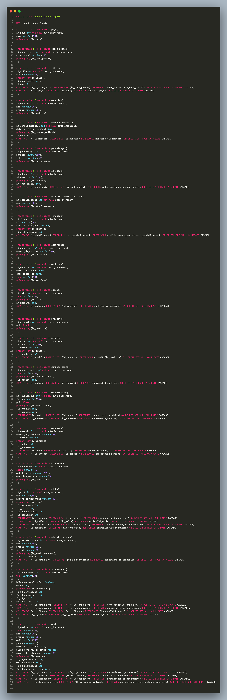

# Rendu Brief 5

## Création des diagrammes, méthode merise

### Tables, 1ère ébauche, brouillon

Dans un premier temps j’ ai cherché le but de la base de données, j’ ai compris que celle-ci devait centraliser toutes les informations des clubs, et permettre aux sportifs d’ avoir accès à leurs statistiques.

Puis, j’ ai commencé à relever les informations qui constituent les clubs, les membres, etc
Ainsi, j’avais une vue sur ce qui pourrait constituer la base de données et les tables qui en découlerait.
Quelques questionnements sur les noms, les éventuels triggers, les informations qui serait non- adaptées…
Voici mes premiers jets de tables:

>**Membres**: 
certificat médical
médecin traitant
nom
prénom
adresse
code postal
ville
mail
mot de passe
login
coordonnées bancaires
cotisations à jour
numéro licencié
parrainé (évolution possible)
parrain (évolution possible)
clubs? (accès à toutes les salles)
machines?
horaire accès machine début
horaire accès machine fin
pénalité oubli d’ éteindre machine?
coach?
statut membre/abo?
abonnement
genre
bilan corporel effectué?
bilan corporel offert?
pays
date souscription (trigger, un an?)
commandes?
corpo analyser (trigger si cotisations ko)
couleur carte parrainage, abonnement
Age (trigger anniversaire?)
**Table pour date, age?
Dois-je faire une table dates?
Abonnements:**
type
tarif
bilan corporel offert?
durée (trigger si modification? vers table membres coach)
accès club
couleur carte
**Banques: (nom?)**
coordonnées bancaires? (plusieurs)
établissement bancaire
à  jour? (car vu historisation données fonction réglement cotisations),
**Machines:?**
badges? (horodatage)
clubs?
salles?
abonnements (accès illimité)
type
**Coachs?**
nom
prénom
mail
ville
adresse
code postal
pays
tarif
abonnement 
cotisation corpo analyser
salle
**Connexions**
login
mdp
id user
question secrète
**Villes?**
**(+Codes postaux)**
**Pays?**
**Médecins**
nom
prénom
ville
adresse 
code postal
**Magasins**
villes
code postal 
adresse
produits
numéro facture
**Produits**
prix
**Fournisseurs**
**Achats**
livraison
réduction
facture
abonnements (accès illimité)
points fid 5%? à revoir
id membre
id magasin
**Données santé**
cotisations membres à jour
cotisations coach à jour
**Clubs**
nom unique
identifiant 
ville
adresse
code postal
contrat assurance
assureur
membre
nb salle,
activités proposées
**Salles**
id unique
activités
membres
coach
club
**gestionnaires? administrateurs? → connexion**
login 
mdp
**Assurances**
contrat
assureur
adresse
ville
code postal
membre
**Parrainages**
parrain
parrainé

J’ ai ensuite décidé de faire un Google sheets, pour éclaircir mes idées en me demandant quelle serait la table centrale.
A mon sens, c’ est celle des membres qui était le noyau de la base de données.

→ Voir document suivant pour complétion: 

[Support d'aide création MCD et MLD](https://docs.google.com/spreadsheets/d/1d6M_UyKV3McSU24fUKJrNhtNspiQTilSdJk1KxLLRq4/edit?usp=sharing)

Et un de mes pense bête:

- Europe accès à tous les clubs, extension internationale?,
- Evolution parrainage,
- Equipe nettoyage et sécurité, => membre?
- Revoir réduction fidélité,...
- Penser aux triggers,
- Voir vues create view!

Après quelques essais papiers, je suis passée à la création du MCD.

### Création du MCD:

J’ ai utilisé app.diagramms.net pour constituer celui-ci, en me basant sur mes réflexions et mon Google sheets pour le remplir.
Je me suis rendue compte qu’ il y avait beaucoup de relations, tables.Il a donc fallu faire un choix afin d’ éviter d’ être dans l’ impossibilité de tout créer .J’ai dû “mettre de côté”, notamment, la partie salles et données relevées lors des séances sportives.

J’ ai décidé, par exemple, de positionner les villes, pays et codes postaux séparément car la société souhaitant être internationale, et les villes pouvant avoir différents codes postaux,cela évite de surcharger la table villes.
Il en va de même pour les adresses, ou même les établissements bancaires car l’ on peut avoir plusieurs comptes dans une même banque.

[MCD via diagramms](https://app.diagrams.net/#G1TOUzLkrRS3FFcQ4MUUUaxAc2wbp56Io4)

[MCD](https://drive.google.com/file/d/1TOUzLkrRS3FFcQ4MUUUaxAc2wbp56Io4/view?usp=sharing)

### Création du MLD:

Voir Google Sheets.

### Création du MPD:

J’ ai finalisé le MPD via mySql.

Voir dossier diagrammes MPD.

## MySql, code

### Création de la base de données:

### Insertion des données:

L’ insertion des données, a été plus complexe, car je ne pouvais me faire à l’ idée de devoir rentrer manuellement les clefs étrangères. J’ ai passé beaucoup de temps à essayer de créer un trigger pour automatiser l’ injection de tables jointes… en vain. 

### Requêter:

### Suppression, mise à jour des données:

### Trigger:

J’ ai eu plein d’ idées concernant les trigger, notamment par rapport aux dates d'anniversaire des abonnements, renouvellement des certificats médicaux, effacement des données si le membre n’ est plus à jour de ses cotisations… 
Faute de temps, et de technique, j’ choisi de faire un trigger qui va permettre d'insérer les données d’une table cible lors de leur suppression, ainsi celles-ci sont historisées.

### Les vues:

A l’ instar des trigger, plusieurs idées de vues me sont venues. Il a fallu bien évidemment appréhender ce que cela est,en effet je n'ai jamais pratiqué les views.
Cela est intéressant, par exemple pour n’ afficher que quelques données lorsqu’ un membre à un statut qui ne lui permet pas de tout visualiser, ou pour gagner du temps suite à des requêtes courantes.

